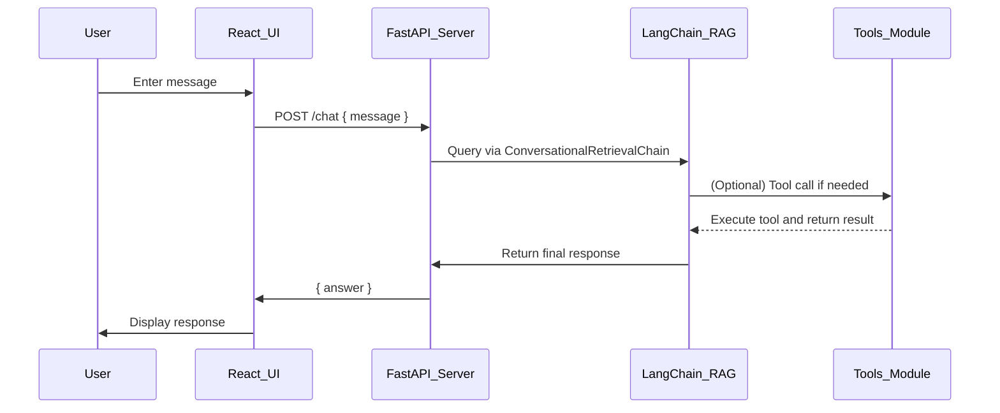

# 📝 Product Requirements Document (PRD)

**Project Name**: Member Support Agent  
**Organization**: Horizon Bay Credit Union  
**Owner**: Benedict Sebastian  
**Last Updated**: June 24, 2025

---

## 1. Problem Definition

Credit union members frequently have questions related to accounts, benefits, policies, and claims. Support representatives are often overwhelmed by repetitive inquiries that could be resolved through existing documentation.  
Manual searching through PDFs and internal guides is inefficient and error-prone. We need a **cost-effective, AI-powered assistant** to answer FAQs, escalate issues, and route information to the right support channels without human intervention.

---

## 2. Core Features

### 🔹 Conversational AI Assistant (Alexa)

- Provides instant, contextual answers from internal documents
- Uses a consistent, professional tone from an identity prompt
- Capable of holding multi-turn conversations with memory

### 🔹 RAG-Based PDF Retrieval

- Automatically loads and chunks PDF documents using `PyMuPDFLoader`
- Stores vector embeddings in Chroma using OpenAI or HuggingFace models
- Retrieves relevant passages using LangChain's Retriever abstraction

### 🔹 Tool-Driven Escalation & Logging

- `log_unknown_question`: alerts the team about gaps in documentation
- `record_user_details`: captures and escalates member inquiries
- `send_notification`: sends real-time Pushover alerts for specific events

### 🔹 React Frontend + FastAPI Backend

- Clean, modern React-based UI (deployed via Vercel or Netlify)
- FastAPI server exposes a `/chat` endpoint for React to query
- Backend processes PDF docs and manages the LangChain RAG pipeline

---

## 3. User Flow



---

## 4. Technical Requirements

### 📄 PDF Document Processing

- Loader:
  ```python
  from langchain.document_loaders import PyMuPDFLoader
  ```
- Directory structure:
  - `data/knowledge_base/` contains categorized PDFs
- Used with:
  ```python
  loader = DirectoryLoader("data/knowledge_base", glob="**/*.pdf", loader_cls=PyMuPDFLoader)
  documents = loader.load()
  ```

### 🧠 RAG Setup

| Component   | LangChain Import                              |
| ----------- | --------------------------------------------- |
| Loader      | `PyMuPDFLoader`                               |
| Chunker     | `CharacterTextSplitter`                       |
| Embeddings  | `OpenAIEmbeddings` or `HuggingFaceEmbeddings` |
| Vectorstore | `Chroma`                                      |
| Retriever   | `vectorstore.as_retriever()`                  |
| Chat Engine | `ConversationalRetrievalChain`                |
| Memory      | `ConversationBufferMemory`                    |

### 🌐 Frontend & Backend

- Frontend:
  - Built in React
  - Calls FastAPI `/chat` endpoint
  - Hosted on Vercel or Netlify
- Backend:
  - FastAPI server hosting LangChain logic
  - Persistent ChromaDB directory in `/data/vector_db/`
  - Hosted on Render, Railway, or Hugging Face Spaces (for demo)

### 🔐 Environment Variables

```env
OPENAI_API_KEY=your-key
PUSHOVER_TOKEN=your-pushover-token
PUSHOVER_USER=your-pushover-user
```

### 📦 Dependency Management

- Uses **UV** for fast Python package management
- Dependencies defined in `pyproject.toml`
- Install with: `uv sync`
- Run with: `uv run python backend/main.py`

---

## 5. Success Criteria

- ✅ Answers ≥80% of common support queries accurately
- ✅ Alerts team for unknown questions or tool calls
- ✅ Retrieves from embedded PDFs with high precision
- ✅ Seamless UX between React frontend and FastAPI backend
- ✅ RAG pipeline initializes on deploy and caches embeddings
- ✅ Successfully deployed to Vercel (UI) and Render/Railway (API)
